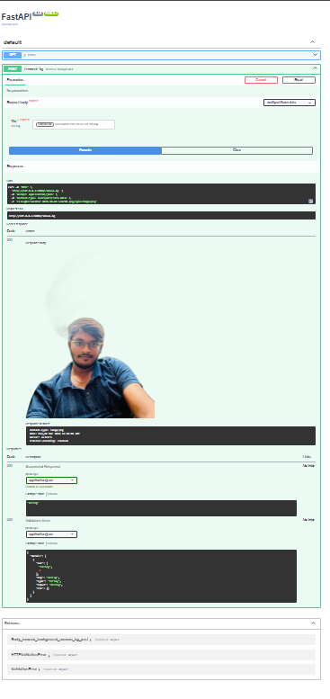

# Railway Background Remover API

AI-powered background removal API built with FastAPI and rembg.

## Demo

## API

POST /remove-bg

Upload an image and get a transparent PNG back.

### Example (curl)

curl -X POST \
  -F "file=@image.jpg" \
  http://localhost:8000/remove-bg \
  --output output.png

## Run locally

pip install -r requirements.txt
uvicorn main:app --reload

## Deploy on Railway

